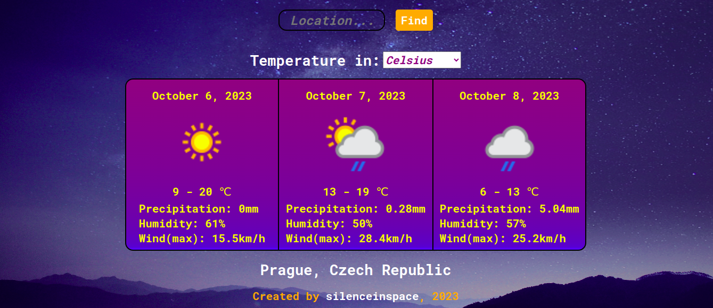

# Weather-app

## Description

The app makes usage of [Weather API](https://www.weatherapi.com/).
Data about a location can be displayed either in Celsius or Fahrenheit. The temperature preference can be dynamically changed any time. After searching for a desired location, a basic weather description is shown after loading. The description reflects a weather condition (e.g. if it is rainy or sunny), total precipitation in milimeters, average humidity in %, maximum wind in km/h.
The app is capable to process weather information only for next three days (including today).

If a country is typed to search for, the app displays its capital's weather. It is also possible to find a location by a US zip/UK Postcode/Canada Postal code, or latitude and longitude. The last can lead to unexpected behavior though. Thus, it is recommended to use search on either a city or country. The input field is case insensitive (e.g. 'paRis' => 'Paris').

The most recent search is stored inside the browser. If the page is accidentally closed, during the next visit the recent location is automatically loaded. However, if it is your first time visiting the page, then weather in city Prague appears on the screen.

The website is unfortunately not responsive on mobile devices; only a desktop version exists at the moment.

### Built with the following technologies:
-  HTML
-  CSS 
-  JavaScript
-  Webpack
-  Fns date library
-  Eslint and prettier

### Credit for images/materials:
- Weather Api (https://www.weatherapi.com/)
- App's main theme (https://unsplash.com/@jokerhoi?utm_source=unsplash&utm_medium=referral&utm_content=creditCopyText) by Chan Hoi

